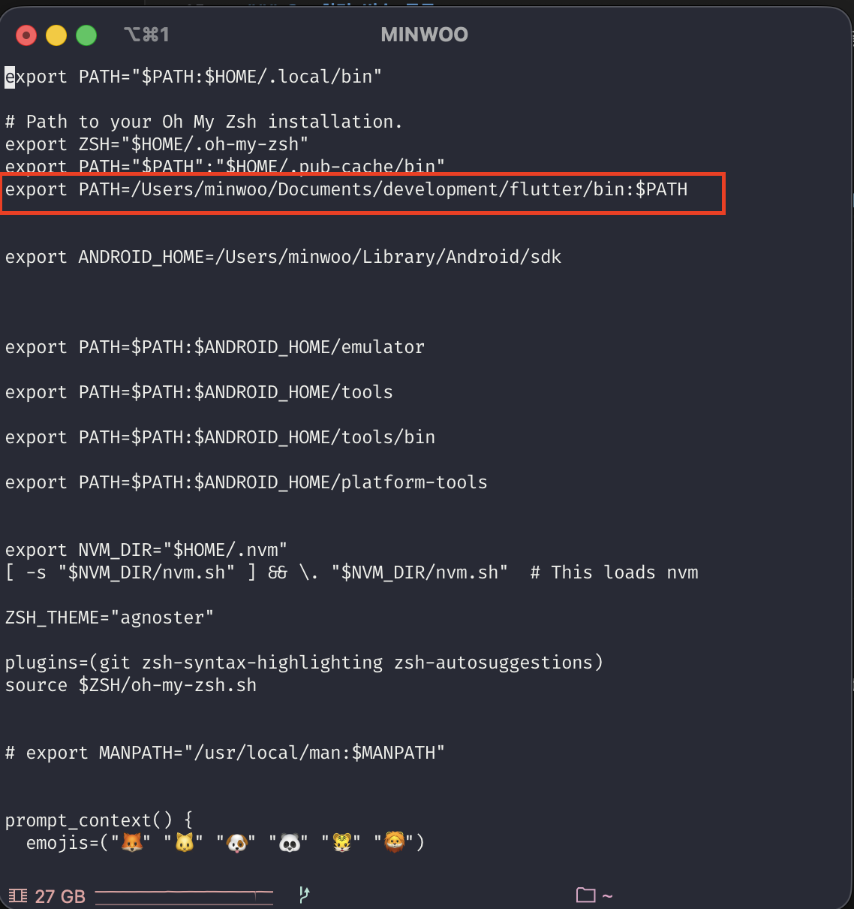
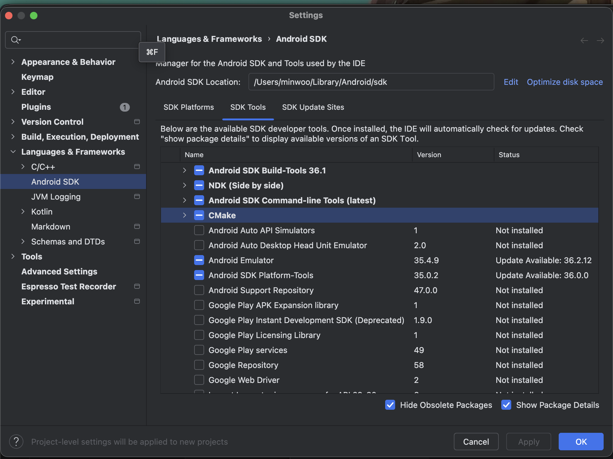
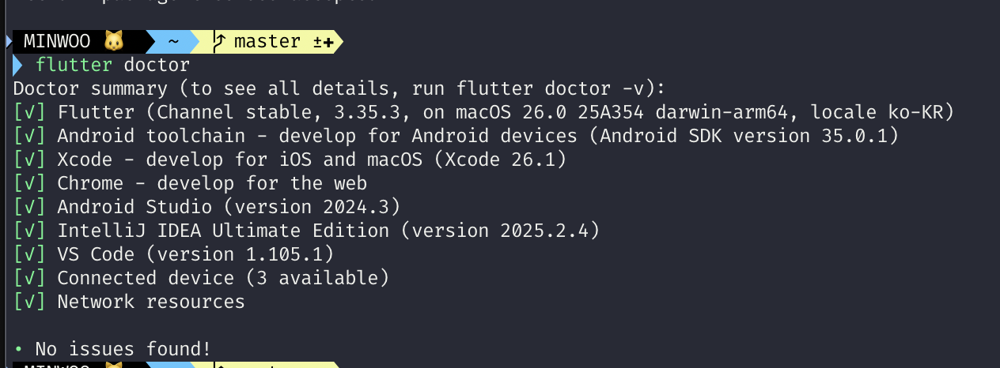
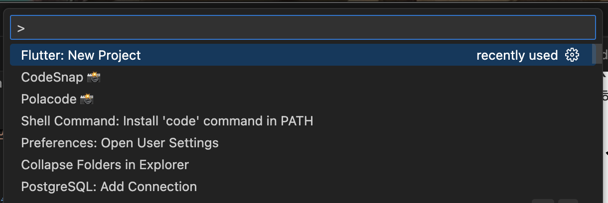

# Flutter Install(Mac OS)

[Flutter Install 링크](https://docs.flutter.dev/install/manual).

### 함께 설치해야할 것 들

- [Home Brew (리눅스 기반 패키지 매니저)](https://brew.sh/)
- [Xcode](https://apps.apple.com/kr/app/xcode/id497799835?mt=12Xcode)
- [Android Sutdio](https://developer.android.com/studio?hl=ko)
- [VSC](https://code.visualstudio.com/)

## 1. Flutter SDK 설치

- Flutter 공식 문서에서 최신 버젼 SDK를 다운로드 받습니다

## 2. 환경 변수 등록

- Fluter SDK의 bin폴더 경로를 아래와 같이 .zshrc파일에 환경변수로 등록해줍니다.

```bash
 vi ~/.zshrc
```

```bash
export PATH=/Users/minwoo/Documents/development/flutter/bin:$PATH
```



## 3. VSC 필수 Extension 설치

- Flutter
  

- Dart
  

android_studio_sdk_tool.png

## 4. Android Studio Tool 설치 확인

  
  
  - Android SDK Command-line tools와 Android SDK Platform-Tools가 체크 되어있고 설치 되어있는지 확인하기

## 5. Xcode 실행해서 Command Line Tool 및 IOS SDK 설치 확인

## 6. Flutter doctor 실행해보기

```bash
flutter doctor
```



- 이슈 있는 부분을 찾아서 해결해준다.
- 위 이미지처럼 전부 다 초록불 들어오면 세팅 완료!

## 7. Flutter 프로젝트 생성해보기

- cmd + shift + p
  

- Flutter : New Project -> Application -> 프로젝트 경로 선택 -> 프로젝트 이름 입력(영문 소문자 & \_ 로만 구성 가능)
- ex) first_project

## 8. 생성된 프로젝트 확인

  
